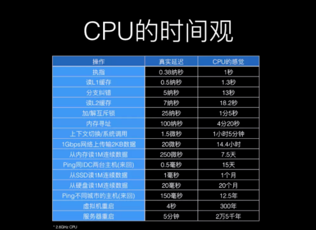

## Python异步编程

#### 详细链接:

https://blog.csdn.net/lu8000/article/details/45025987?utm_medium=distribute.pc_relevant_download.none-task-blog-blogcommendfrombaidu-1.nonecase&depth_1-utm_source=distribute.pc_relevant_download.none-task-blog-blogcommendfrombaidu-1.nonecas

### 1、什么是异步编程？

```
1.1 阻塞
    程序未得到所需计算资源时被挂起的状态。
    程序在等待某个操作完成期间，自身无法继续干别的事情，则称该程序在该操作上是阻塞的。
    常见的阻塞形式有：网络IO阻塞，磁盘IO阻塞,用户输入阻塞
阻塞是无处不在的,包括CPU切换上下文时,所有的进程都无法真正干事情,它们也会被阻塞。
如果是多核CPU则正在执行上下文切换操作的核不可被利用。

1.2 非阻塞
    程序在等待某操作过程中，自身不被阻塞，可以继续运行干别的事情，则称该程序在该操作上是非阻塞的。
    非阻塞并不是在任何程序级别、任何情况下都可以存在的。
    仅当程序封装的级别可以囊括独立的子程序单元时，它才可能存在非阻塞状态。

非阻塞的存在是因为阻塞存在，正因为某个操作阻塞导致的耗时与效率低下，我们才要把它变成非阻塞的。

1.3 同步
    不同程序单元为了完成某个任务，在执行过程中需要靠某种通信方式来协调一致，称这些程序单元是同步执行的。
    例如：购物系统中更新商品库存，需要用“行锁”作为通信信号，让不同的更新请求强制排队顺序执行，那更新库存的操作就是同步的。
    简言之，同步意味着有序。

1.4 异步
    为完成某个任务，不同程序单元之间过程中无需通信协调，也能完成任务的方式。
    不相关的程序单元之间可以是异步的。
    例如：爬虫下载网页，调度程序下载程序后，即可调度其他任务，而无需与该下载任务保持通信来协调行为。不同网页的下载、保存等操作都是无关的，也无需相互通知协调。这些异步操作的完成时刻不确定。
    
上面提到的“通信方式”通常是指异步和并发编程提供的同步原语，如信号量、锁、同步队列等等。我们需要知道，虽然这些通信方式是为了让多个程序在一定条件下同步执行，但正因为是异步的存在，才需要这些通信方式，如果所有程序都是按顺序执行，其本身就是同步的，又何需这些同步信号呢？

1.5 并发
    并发描述的是程序的组织结构。指程序要被设计成多个可独立执行的子任务。
    以利用有限的计算机资源使多个任务可以被实时或接近实时执行为目的。

1.6 并行
    并行描述的是程序的执行状态。值多个任务同时被执行。
    以利用富余计算（多核CPU）加速完成多个任务为目的。
 
并发提供了一种程序组织结构方式，让问题的解决方案可以并行执行，但并行执行不是必须的。

1.7 概念总结
    并行：是为了利用多核加速任务完成的进度
    并发：是为了让独立的子任务有机会被尽快执行，但不一定能加速整体进度
    非阻塞：是为了提高程序整体执行效率
    异步：是高效地组织非阻塞任务的方式

要支持并发，必须拆分为多任务，不同任务相对而言才有阻塞、非阻塞、同步、异步。所以，并发，异步，非阻塞三个词总是如影随形。

1.8 异步编程
    以进程、线程、协程、函数/方法作为执行任务程序的基本单位，结合回调、事件循环、信号量等机制，以提高程序整体执行效率和并发能力的编程方式。
    
如果在某程序的运行时，能根据已经执行的指令准确判断它接下来要进行哪个具体操作，那么它是同步程序，反之则为异步程序。

同步异步、阻塞非阻塞并非水火不容，要看讨论的程序所处的封装级别。例如：购物程序在处理多个用户的浏览请求可以是异步的，而更新库存时必须是同步的。

1.9 异步之难
    控制不住自己写的程序，因为其执行顺序的不可预料，当下正要发生什么事件不可预料。在并行情况下更为复杂和艰难。
    所以，几乎所有的异步框架都将异步编程模型简化：一次只允许处理一个事件。故而有关异步的讨论几乎都集中在单线程内。
    如果某事件处理程序需要长时间执行，所有其他部分都会被阻塞。
所以，一旦采取异步编程，每个异步调用必须“足够小”，不能耗时太久。如何拆分异步任务成了难题。
    1、程序下一步行为往往依赖上一步的执行结果，如何知晓上次异步调用已经完成并获取结果？
    2、回调成了必然选择。那又需要面临“回调地狱”的折磨。
    3、同步代码改为异步代码，必然破坏代码结构。
    4、解决问题的逻辑也要改变，不再是一条路走到黑，需要精心安排异步任务。
    
```

### 2、为何要用异步？

```
2.1 CPU的时间观

2.2 面临的问题
    1、成本问题
    2、效率问题
    3、C10K/C10M挑战
       C10K(concurrently handling 10k connections) 是一个在1999年被提出来的技术挑战,如何在一颗1GHz CPU,2G内存,1gbps网络环境下,让单台服务器同时为1万个客户端提供FTP服务。到了2010年后,随着硬件技术的发展,这个问题被延伸为C10M，即如何利用8核心CPU，64G内存，在10gbps的网络上保持1000万并发连接,或是每秒钟处理100万的连接。（两种类型的计算机资源在各自的时代都约为1200美元）

成本和效率问题是从企业经营角度讲，C10K/C10M问题则是从技术角度出发挑战软硬件极限。C10K/C10M问题得解，成本问题和效率问题就迎刃而解。

2.3 解决方案
    除了瓶颈之外，任何改进都是幻觉。
    CPU告诉我们,它自己很快,而上下文切换慢，内存读数据慢，磁盘寻址与取数据慢、网络传输慢...总之，离开CPU后的一切，除了一级高速缓存，都很慢。我们观察计算机的组成可以知道，主要由运算器、控制器、存储器、输入设备、输出设备五部分组成。运算器和控制器主要集成在CPU中，除此之外全是IO，包括读写内存，读写磁盘，读写网卡全都是IO，IO成了最大的瓶颈。
    异步程序可以提高效率，而醉倒的瓶颈在IO,业界诞生的解决方案不出意料:异步IO
```



### 3、异步IO进化之路

```
网络IO是最大的IO瓶颈,除了宕机没有比它更慢的。所以，诸多异步框架都对准的是网络IO
```

```python
# -*- coding: utf-8 -*-
import socket
import time


def blocking_way():
    """同步阻塞"""
    sock = socket.socket()
    # blocking
    sock.connect(("example.com", 80))
    request = "GET / HTTP/1.0\r\nHost: example.com\r\n\r\n"
    sock.send(request.encode("ascii"))
    response = b""
    chunk = sock.recv(4096)
    while chunk:
        response += chunk
        # blocking  从socket中读取4K字节数据
        chunk = sock.recv(4096)
    return response


def sync_way():
    """同步方式"""
    res = []
    for i in range(10):
        res.append(blocking_way())
    print(len(res))
    return len(res)


t1 = time.time()
sync_way()
t2 = time.time()
print(t2 - t1)
```

```
我们知道,创建网络连接,多久能创建完成不是客户端决定的,而是由网络状况和服务器处理能力共同决定的。服务端什么时候返回了响应数据并被客户端接收到可供程序读取，也是不可预测的。所以socke.connect()和sock.recv()这两个调用在默认情况下是阻塞的。

注意：sock.send()函数并不会阻塞太久,它只负责将请求数据拷贝到TCP/IP协议栈的系统缓冲区中就返回，并不等待服务端返回的应答确认。

假设网络环境很差，创建网络连接需要1秒钟，那么sock.connect()就得阻塞1秒钟,等待网络连接成功。这1秒钟对一颗2.6GHz的CPU来讲,仿佛过去了83年，然而它不能干任何事情，sock.recv()也是一样的必须得等到服务端的响应数据已经被客户端接收。我们下载10篇网页，这个阻塞过程就得重复10次，如果一个爬虫系统每天要下载1000万篇网页呢？
```

#### 3.2 改进方式：多进程

```
在一个程序内，依次执行10次太耗时，那开10个一样的程序同时执行不就行了？于是我们想到了多进程编程。为什么会先想到多进程呢？发展脉络如此。在更早的操作系统（Linux 2.4）及其以前，进程是OS调度任务的实体，是面向进程设计的OS。
```

```python
# -*- coding: utf-8 -*-
import socket
import time
from concurrent import futures


def blocking_way():
    """同步阻塞"""
    sock = socket.socket()
    # blocking
    sock.connect(("example.com", 80))
    request = "GET / HTTP/1.0\r\nHost: example.com\r\n\r\n"
    sock.send(request.encode("ascii"))
    response = b""
    chunk = sock.recv(4096)
    while chunk:
        response += chunk
        # blocking  从socket中读取4K字节数据
        chunk = sock.recv(4096)
    return response


def process_way():
    """多进程方式"""
    workers = 10
    with futures.ProcessPoolExecutor(workers) as executor:
        futs = {executor.submit(blocking_way) for _ in range(10)}
    return len([fut.result() for fut in futs])


t1 = time.time()
process_way()
t2 = time.time()
print(t2 - t1)
```

```
改善效果立竿见影。但仍然有问题。总体耗时并没有缩减为原来的十分之一，而是九分之一左右，还有一些时间消耗到哪里去了？ 进程切换开销。

进程切换开销不止像“CPU的时间观”所列举的“上下文切换”那么低。CPU从一个进程切换到另一个进程，需要把旧进程运行时的寄存器状态、内存状态全部保存好，再将另一个进程之前保存的数据恢复。对CPU来讲，几个小时干等着，当进程数量大于CPU核心数量时，进程切换时必然需要的。

除了切换开销，多进程还有另外的缺点。一般的服务器在能够稳定运行的前提下，可以同时处理的进程数在数十个到数百个规模。如果进程数量规模更大，系统运行将不稳定，而且可用内存资源往往也会不足。

多进程解决方案在面临每天需要成百上千万次下载任务的爬虫系统，或者需要同时搞定数万并发的电商系统来说，并不适合。

除了切换开销大，以及可支持的任务规模小之外，多进程还有其他的缺点，如果状态共享等问题。后文会有提及，此处不再细究。
```

#### 3.3 继续改进：多线程

```
由于线程的数据结构比进程更轻量级,同一个进程可以容纳多个线程,从进程到线程的优化由此展开。后来的OS也把调度单位由进程转为线程，进程只作为线程的容器，用于管理进程所需的资源。而且OS级别的线程是可以被分配到不同的CPU核心同时运行的。
```

```python
# -*- coding: utf-8 -*-
import socket
import time
from concurrent import futures


def blocking_way():
    """同步阻塞"""
    sock = socket.socket()
    # blocking
    sock.connect(("example.com", 80))
    request = "GET / HTTP/1.0\r\nHost: example.com\r\n\r\n"
    sock.send(request.encode("ascii"))
    response = b""
    chunk = sock.recv(4096)
    while chunk:
        response += chunk
        # blocking  从socket中读取4K字节数据
        chunk = sock.recv(4096)
    return response


def thread_way():
    """多线程方式"""
    workers = 10
    with futures.ThreadPoolExecutor(workers) as executor:
        futs = {executor.submit(blocking_way) for _ in range(10)}
    return len([fut.result() for fut in futs])


t1 = time.time()
thread_way()
t2 = time.time()
print(t2 - t1)
```

```
比多进程耗时要少些。从运行时间上看，多线程似乎以及解决了切换开销大的问题，而且可支持的任务数量规模，也变成了数百个到数千个。

但是，多线程仍有问题，特别是Python里的多线程。首先，Python中的多线程因为GIL的存在，它们并不能利用CPU多核优势，一个Python进程中，只允许有一个线程处于运行状态，那为什么结果还是如预期，耗时缩减到了十分之一？

因为在做阻塞的系统调用时，例如：sock.connect()，sock.recv()时，当前线程会释放GIL，让别的线程有执行机会。但是在单个线程内，在阻塞调用上还是阻塞的。

小提示：Python中 time.sleep 是阻塞的,都知道使用它要谨慎，但在多线程编程中，time.sleep并不会阻塞其他线程。

除了GIL之外,所有的多线程还有通病，它们是被OS调度，调度策略是抢占式的，以保证同等优先级的线程都有均等的执行机会，那带来的问题是：并不知道下一时刻是哪个线程被运行，也不知道它正要执行的代码是什么。所以就可能存在竞态条件。

例如：爬虫工作线程从任务队列拿待抓取URL的时候,如果多个爬虫线程同时来取,那这个任务到底交给谁?那就需要用到"锁"或者"同步队列"来保证下载任务不会被重复执行。

而且线程支持的多任务规模，在数百到数千的数量级。在大规模的高频网络交互系统中，仍然有些吃力。当然，多线程最主要的问题还是竞态条件。
```

#### 3.4 非阻塞方式

```python
# -*- coding: utf-8 -*-
import socket
import time


def nonblocking_way():
    """非阻塞"""
    sock = socket.socket()
    sock.setblocking(False)
    try:
        sock.connect(("example.com", 80))
    except BlockingIOError:
        # 非阻塞连接过程中也会抛出异常
        pass

    request = "GET /HTTP/1.0\r\nHost: example.com\r\n\r\n"
    data = request.encode("ascii")
    # 不知道socket何时就绪,所以不断尝试发送
    while True:
        try:
            sock.send(data)
            # 直到send不抛异常,则发送完成
            break
        except OSError:
            pass

    response = b""
    while True:
        try:
            chunk = sock.recv(4096)
            while chunk:
                response += chunk
                chunk += sock.recv(4096)
            break
        except OSError:
            pass
    return response


def sync_way():
    """同步非阻塞"""
    res = []
    for i in range(10):
        res.append(nonblocking_way())
    return len(res)


t1 = time.time()
sync_way()
t2 = time.time()
print(t2 - t1)
```

```
首先注意到两点,就感觉被骗了。一是耗时与同步阻塞相当，而是代码更复杂。要非阻塞何用？且慢。
sock.setblocking(False) 告诉OS，让socket上阻塞调用都改为非阻塞调用方式。之前我们说到，非阻塞就是在做一件事的时候，不阻碍调用它的程序做别的事情。上述代码在执行完**sock.connect()和
**sock.recv()后的确不再阻塞,可以继续往下执行请求准备的代码或者是执行下一次读取。

代码变得更复杂也是上述原因所致，第11行要放在try语句内,在send()之时并不知道socket的连接是否就绪,只有不断尝试，尝试成功为止，即发送数据成功了。recv()调用也是同理。

虽然connect()和recv()不再阻塞主程序,空出来的时间段CPU没有空闲着,但并没有利用好这空闲去做其他有意义的事情,而是在循环尝试读写socket(不停判断非阻塞调用的状态是否就绪)。还得处理来自底层的可忽略的异常。也不能同时处理多个socket。

然后10次下载任务仍然按序进行，所以总体执行时间和同步阻塞相当。如果非得这样，那还不如同步阻塞。

```

#### 3.5 非阻塞改进

```
1、epoll
   判断非阻塞调用是否就绪如果OS能做,是不是应用程序就可以不用自己去等待和判断了？就可以利用这个空闲去做其他事情以提高效率。
   所以OS将IO状态的变化都封装成了事件,如可读事件、可写事件。并且提供了专门的系统模块让应用程序可以接收事件通知。这个模块就是select。让应用程序可以通过select注册文件描述符和回调函数。当文件描述符的状态发生变化时,select就调用事先注册的回调函数。
   select 因其算法效率比较低，后来改进成了poll,再后来又有进一步改进,BSD内核改进成了kqueue模块,而linux内核改进成了epoll模块。这四个模块的作用都相同，暴露给程序员使用的API也几乎一致,区别在于kqueue和epoll在处理大量文件描述符时效率更高。
   鉴于Linux服务器的普遍性,以及为了追求更高效率,所以我们常常听闻被探讨的模块都是epoll。

2、回调（CallBack）
   把IO事件的等待和监听任务交给了OS,那OS在知道IO状态发生改变后(例如socket连接已建立成功可发送数据),它又怎么知道接下来该干嘛呢? 只能回调。
   需要我们将发送数据与读取数据封装成独立的函数，让epoll代替应用程序监听socket状态时,得告诉epoll:"如果socket状态变为可以往里写数据(连接建立成功了),请调用HTTP请求发送函数。如果socket变为可以读数据了(客户端已经收到响应),请调用响应处理函数。"
   于是我们利用epoll结合回调机制重构爬虫代码:
   ...
```

```python
# -*- coding: utf-8 -*-
import socket
import time
from selectors import DefaultSelector, EVENT_READ, EVENT_WRITE

selector = DefaultSelector()
stopped = False
urls_todo = {"/", "/1", "/2", "/3", "/4", "/5", "/6", "/7", "/8", "/9"}


class Crawler:

    def __init__(self, url):
        self.url = url
        self.sock = None
        self.response = b""

    def fetch(self):
        self.sock = socket.socket()
        self.sock.setblocking(False)
        try:
            self.sock.connect(("example.com", 80))
        except BlockingIOError:
            pass

        selector.register(self.sock.fileno(), EVENT_WRITE, EVENT_READ)

    def connected(self, key, mask):
        selector.unregister(key.fd)
        request = "GET {0} HTTP/1.0\r\nHost: example.com\r\n\r\n".format(self.url)
        self.sock.send(request.encode("ascii"))
        selector.register(key.fd, EVENT_READ, self.read_response)

    def read_response(self, key, mask):
        global stopped
        # 如果响应大于4KB,下一次循环会继续
        chunk = self.sock.recv(4096)
        if chunk:
            self.response += chunk
        else:
            selector.unregister(key.fd)
            urls_todo.remove(self.url)
            if not urls_todo:
                stopped = True

```

```
这里和前面稍有不同的是,我们将下载不同的10个页面,相对URL路径存放于urls_todo集合中。
改进：
    首先，不断尝试send()和recv()的两个循环被消灭掉了。
    其次，导入了selectors模块,并创建了一个DefaultSelector实例。Python标准库提供的selectors模块是对底层select/poll/epoll/kqueue的封装。DefaultSelector类会根据OS环境自动选择最佳的模块。
    然后，在第25行和第31行分别注册了socket可写事件和可读事件发生后应该采取的回调函数。

虽然代码结构清晰明了，阻塞操作也交给OS去等待通知了，但是我们要抓取10个不同页面，就得创建10个Crawler实例，就有20个事件将要发生，那如何从selector里获取当前正发生的事件,并且得到对应的回调函数去执行呢？

3、事件循环（Event Loop）
   为了解决上述问题，那我们只得采用老办法，写一个循环，去访问selector模块,等待它告诉我们当前是哪个事件发生了,应该对应哪个回调。这个等待事件通知的循环，称之为事件循环。
```

```python
def loop():
    while not stopped:
        # 阻塞,直到一个事件发生
        events = selector.select()
        for event_key, event_mask in events:
            callback = event_key.data
            callback(event_key, event_mask)
```

```
上述代码中，我们用stopped全局变量控制事件循环何时停止。当urls_todo消耗完毕后，会标记stopped为True。

重要的是第49行代码，selector.select()是一个阻塞调用,因为如果事件不发生,那应用程序就没事件可处理,所以就干脆阻塞在这里等待事件发生。那可以推断，如果只下载一篇网页，一定要connect()之后才能send()继而recv()，那它的效率和阻塞的方式是一样的。因为不在connect()/recv()上阻塞,也得在select()上阻塞。

所以，selector机制(后文以此称呼代指epoll/kqueue)是设计用来解决大量并发连接的。当系统中有大量非阻塞调用，能随时产生事件的时候，selector机制才能发挥最大的威力。

下面是如何启动创建10个下载任务和启动事件循环的：
```

```python
if __name__ == '__main__':
    start = time.time()
    for url in urls_todo:
        crawler = Crawler(url)
        crawler.fetch()
    loop()
    print(time.time() - start)
```

完整代码：

```python
# -*- coding: utf-8 -*-
import socket
import time
from selectors import DefaultSelector, EVENT_READ, EVENT_WRITE

selector = DefaultSelector()
stopped = False
urls_todo = {"/", "/1", "/2", "/3", "/4", "/5", "/6", "/7", "/8", "/9"}


class Crawler:

    def __init__(self, url):
        self.url = url
        self.sock = None
        self.response = b""

    def fetch(self):
        self.sock = socket.socket()
        self.sock.setblocking(False)
        try:
            self.sock.connect(("example.com", 80))
        except BlockingIOError:
            pass

        selector.register(self.sock.fileno(), EVENT_WRITE, self.connected)

    def connected(self, key, mask):
        selector.unregister(key.fd)
        request = "GET {0} HTTP/1.0\r\nHost: example.com\r\n\r\n".format(self.url)
        self.sock.send(request.encode("ascii"))
        selector.register(key.fd, EVENT_READ, self.read_response)

    def read_response(self, key, mask):
        global stopped
        # 如果响应大于4KB,下一次循环会继续
        chunk = self.sock.recv(4096)
        if chunk:
            self.response += chunk
        else:
            selector.unregister(key.fd)
            urls_todo.remove(self.url)
            if not urls_todo:
                stopped = True


def loop():
    while not stopped:
        # 阻塞,直到一个事件发生
        events = selector.select()
        for event_key, event_mask in events:
            callback = event_key.data
            callback(event_key, event_mask)


if __name__ == '__main__':
    start = time.time()
    for url in urls_todo:
        crawler = Crawler(url)
        crawler.fetch()
    loop()
    print(time.time() - start)
```

```
上述执行结果令人振奋。在单线程内用 事件循环 + 回调 搞定了10篇网页同时下载的问题。
这就已经是异步编程了。虽然有一个for循环顺序地创建Crawler实例并调用 fetch() 方法,但是fetch 内仅有connect()和注册可写事件,而且从执行时间明显可以推断,多个下载任务确实在同时进行!

上述代码异步执行的过程:

1、创建Crawler实例
2、调用fetch方法,会创建socket连接和在selector上注册可写事件
3、fectch内并无阻塞操作,该方法理解返回
4、重复上述3个步骤，将10个不同的下载任务都加入事件循环
5、启动事件循环，进入第一轮循环，阻塞在事件监听上
6、当某个下载任务EVENT_WRITE被触发,回调其connected方法,第一轮事件循环结束
7、进入第2轮事件循环，当某个下载任务有事件触发，执行其回调函数；此时已经不能推测是哪个事件发    生，因为有可能是上次connected里的EVENT_READ先被触发，也可能是其他某个任务的              EVENT_WRITE被触发(此时,原来在一个下载任务上会阻塞的那段时间被利用起来执行另一个下载任务了)
8、循环往复，知道所有下载任务被处理完成
9、退出事件循环，结束整个下载程序
```

#### 3.6 总结

```
目前为止,我们已经从同步阻塞学习到了异步非阻塞。掌握了在单线程内同时并发执行多个网络IO阻塞型任务的黑魔法.而且与多线程相比,连线程切换也没有了。执行回调函数时函数调用开销，在线程的栈内完成，因此性能也更好，单机支持的任务规模也变成了数万到数十万个。

部分编程语言，对异步编程的支持就止步于此（不包括语言官方之外的扩展）。需要程序员直接使用epoll去注册事件和回调、维护一个事件循环，然后大多数时间都花在设计回调函数上。

通过本节学习，我们应该认识到，不论什么编程语言，但凡要做异步编程，上述的“事件循环 + 回调” 这种模式是逃不掉的，尽管它可能用的不是epoll,也可能不是while循环。

为什么我们在某些异步编程中并没有看到CallBack模式呢？ 这就是我们接下来要探讨的问题。
```

### 4、Python 对异步IO的优化之路

```
我们将在本节学习到Python生态对异步编程的支持时如何继承前文所述的"事件循环 + 回调" 模式演变到asyncio的原生协程模式。

4.1 回调之痛，以终为始
    在第三节中，我们已经学会了“事件循环 + 回调”的基本运行原理，可以基于这种方式在单线程内实现异步编程。也确实能够大大提高程序运行效率。但是，刚才所学的只是最基本的，然而在生成项目中，要应对的复杂度会大大增加。考虑如下问题：
    如果回调函数执行不正常该如何？
    如果回调里面还要嵌套回调怎么办？要嵌套很多层怎么办？
    如果嵌套了多层，其中某个环节出错了会造成什么后果？
    如果有个数据需要被每个回调都处理怎么办？
    ...

在实际编程中，上述系列问题不可避免。在这些问题的背后隐藏着回调编程模式的一些缺点：

    1、回调层次过多时代码可读性差
    2、破坏代码结构
    3、共享状态管理困难
    4、错误处理困难
```

```python
1、回调层次过多时代码可读性差
def callback_1():
  # processing ...
  def callback_2():
      # processing.....
      def callback_3():
          # processing ....
          def callback_4():
              #processing .....
              def callback_5():
                  # processing ......
              async_function(callback_5)
          async_function(callback_4)
      async_function(callback_3)
  async_function(callback_2)
async_function(callback_1)
```

```python
2、破坏代码结构
写同步代码时，关联的操作时自上而下运行：
    do_a()
    do_b()
    ...
  如果b处理依赖于a处理的结果，而a过程是异步调用，就不知a何时能返回值,需要将后续的处理过程以callback的方式传递给a，让a执行完以后可以执行b。代码变化为：
    do_b(do_a())
  如果整个流程中全部改为异步处理,而流程比较长的话，代码逻辑就会变成这样：
    do_a(do_b(do_c(do_d(do_e(do_f(......))))))
    
   上面实际也是回调地狱式的风格，但这不是主要矛盾。主要在于，原本从上而下的代码结构，要改成从内到外的。先f，再e，再d，...，直到最外层a执行完成。在同步版本中，执行完a后执行b，这是线程的指令指针控制着流程，而在回调版本中，流程就是程序员需要注意和安排的。
```

```python
3、共享状态管理困难
回顾第3节爬虫代码,同步阻塞版的sock对象从头使用到尾，而在回调的版本中，我们必须在Crawler实例化后的对象self里面保存它自己的sock对象。如果不是采用OOP的编程风格，那需要把共享的状态接力似的传递给每一个回调。多个异步调用之间，到底要共享哪些状态，事先就得考虑清楚，精心设计。
```

```python
4、错误处理困难
一连串的回调构成一个完整的调用链。例如上述的a到f，假如d抛了异常怎么办？
整个调用链断掉，接力传递的状态也会丢失，这种现象称为 调用栈撕裂。 c不知道该干嘛，继续异常，然后是b异常,接着a异常。好么，报错日志就告诉你，a调用出错了,但实际是d出错。所以，为了防止栈撕裂，异常必须以数据的形式返回，而不是直接抛出异常，然后每个回调中需要检查上次调用的返回值，以防错误吞没。
```

```
如果说代码风格难看是小事，但栈撕裂和状态管理困难这两个缺点会让基于回调的异步编程很艰难。所以不同编程语言的生态都在致力于解决这个问题。才诞生了后来的Promise、Co-routine等解决方案。

Python生态也以终为始，秉承着“程序员不必为难程序员”的原则，即使让语言和框架开发者苦逼一点，也要让应用开发者舒坦。在 事件循环 + 回调 的基础上衍生出了基于协程的解决方案，代表作有 Tornado、Twisted、asyncio等。接下来我们随着Python生态异步编程的发展过程，深入理解Python异步编程。
```

#### 4.2 核心问题

```
  通过前面的学习,我们清楚地认识到异步编程最大的困难:异步任务何时执行完毕？ 接下来要对异步调用的返回结果做什么操作？
  上述问题我们已经通过事件循环和回调解决了。但是回调会让程序变得复杂。要异步，必回调，又是否有办法规避其缺点呢？那需要弄清楚其本质，为什么回调时必须的？还有使用回调时克服的那些缺点又是为了什么？
  
  答案是程序为了知道自己已经干了什么？正在干什么？将来要干什么？换言之，程序得知道当前所处的状态，而且要将这个状态在不同的回调之间延续下去。
  
  多个回调之间的状态管理困难，那让每个回调都能管理自己的状态怎么样？链式调用会有栈撕裂的困难，让回调之前不再链式调用会怎样？不链式调用的话，那又如何让被调用者知道已经完成了？那就让这个回调通知那个回调如何？而且一个回调，不就是一个待处理任务吗？
  
  任务之间得相互通知，每个任务得有自己的状态。那不就是很古老的编程技法：协作式多任务？ 然而要在单线程内做调度，对了，就是 协程！ 每个协程具有自己的栈帧，当然能知道自己处于什么状态，协程之间可以协作那自然可以通知别的协程。

```

#### 4.3 协程

```
协程(Co-routine)，即是协作式的例程。

它是非抢占式的多任务子例程的概括。可以允许有多个入口点在例程中确定的位置来控制程序的暂停与恢复执行。

例程是什么？ 编程语言定义的可被调用的代码段，为了完成某个特定功能而封装在一起的一系列指令。一般的编程语言都用 函数或方法 的代码结构来体现。
```

#### 4.4 基于生成器的协程

```
早期的Pythoner发现Python中有种特殊的对象——生成器，它的特点和协程很像。每一次迭代之间，会暂停执行，继续下一次迭代的时候还不会丢失之前的状态。（就是有记忆功能）

为了支持用生成器做简单的协程，Python2.5 对生成器进行了增强（PEP 342），该增强提案的标题是 “Coroutines via Enhanced Generators”。有了PEP 342的加持，生成器可以通过yield 暂停执行和向外返回数据，也可以通过send()向生成器内部发送数据，还可以通过throw()向生成器内抛出异常，以便随时终止生成器的运行。

接下来，我们用基于生成器的协程来重构之前的爬虫代码：
```

#### 4.5 未来对象（Future）

```
不用回调的方式了，怎么知道异步调用的结果呢？先设计一个对象，异步调用执行完的时候，就把结果放在它里面。这种对象称之为未来对象。
```

```python
class Future:

    def __init__(self):
        self.result = None
        self._callbacks = []

    def add_done_callback(self, fn):
        self._callbacks.append(fn)

    def set_result(self, result):
        self.result = result
        for fn in self._callbacks:
            fn(self)
```

```
未来对象有一个result属性，用于存放未来的执行结果。还有个set_result()方法，是用于设置result的，并且会在给result绑定值以后运行事先给future添加的回调。回调是通过未来对象的add_done_callback()方法添加的。

不要疑惑此处的callback,说好了不回调的嘛? 难道忘了我们曾经说的要异步，必回调。不过也别急，此处的回调，和先前学到的回调，还真有点不一样。
```

#### 4.6 重构Crawler

```python
现在不论如何，我们有了未来对象可以代表未来的值。先用Future来重构爬虫代码。
```

```python
# -*- coding: utf-8 -*-
import socket
import time
from selectors import DefaultSelector, EVENT_READ, EVENT_WRITE

selector = DefaultSelector()
stopped = False
urls_todo = {"/", "/1", "/2", "/3", "/4", "/5", "/6", "/7", "/8", "/9"}


class Future:

    def __init__(self):
        self.result = None
        self._callbacks = []

    def add_done_callback(self, fn):
        self._callbacks.append(fn)

    def set_result(self, result):
        self.result = result
        for fn in self._callbacks:
            fn(self)


class Crawler:

    def __init__(self, url):
        self.url = url
        self.response = b""

    def fetch(self):
        sock = socket.socket()
        sock.setblocking(False)

        try:
            sock.connect(("example.com", 80))
        except BlockingIOError:
            pass

        f = Future()

        def on_connected():
            f.set_result(None)

        selector.register(sock.fileno(), EVENT_WRITE, on_connected)
        yield f
        selector.unregister(sock.fileno())
        request = "GET {0} HTTP/1.0\r\nHost: example.com\r\n\r\n".format(self.url)
        sock.send(request.encode("ascii"))

        global stopped
        while True:
            f = Future()

            def on_readable():
                f.set_result(sock.recv(4096))

            selector.register(sock.fileno(), EVENT_READ, on_readable)
            chunk = yield f
            selector.unregister(sock.fileno())
            if chunk:
                self.response += chunk
            else:
                urls_todo.remove(self.url)
                if not urls_todo:
                    stopped = True
                break

```

```
和之前的回调版本相比，已经有了较大差异。fetch方法内有了yield表达式，使它成为了生成器。我们知道生成器需要先调用next()迭代一次或者是先send(None)启动,遇到yield之后便暂停。那这fetch生成器如何再次恢复执行呢?至少Future和Crawler都没看到相关代码。
```

