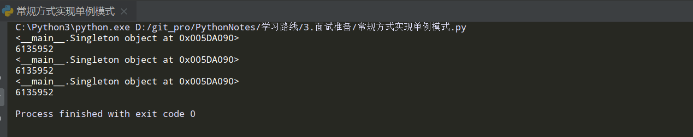
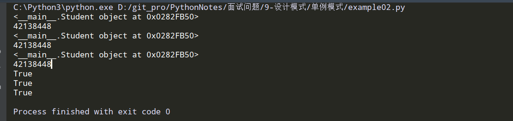

### 单例模式

```
单例模式定义:具有该模式的类只能生成一个实例对象
在python中认为一切皆对象(元类除外).类,函数都可以看做一个对象.
既然是对象就可以作为参数在函数中传递.
```


常见写法:

```python
# -*- coding: utf-8 -*-
class Singleton(object):
    # 先赋值空
    _instance = None

    def __new__(cls, *args, **kwargs):
        """重写__new__方法"""

        # 判断:为空就创建一个实例对象
        if cls._instance is None:
            # 使用父类的__new__方法创建一个实例对象
            cls._instance = object.__new__(cls)
            # 返回实例
            return cls._instance
        else:
            # 返回实例
            return cls._instance


stu = Singleton(25, "shdudhsv")
print(stu)
print(id(stu))
stu1 = Singleton(26, "dfhufdvh")
print(stu1)
print(id(stu1))
stu2 = Singleton(27, "sjisv")
print(stu2)
print(id(stu2))
```

执行结果:



可以看到 三个实例对象 的内存地址 是一样的,说明符合单例模式.


装饰器方式(实际开发中使用这种):

```python
# -*- coding: utf-8 -*-
def singleton(cls, *args, **kwargs):  # cls:可以传入一个类
    """实现单例模式的装饰器"""

    # 字典,保存单例对象
    instances = dict()

    def get_instance(*args, **kwargs):
        # 内层函数获得单例对象
        if cls not in instances:
            # 字典中没有这个单例对象就存进去
            instances[cls] = cls(*args, **kwargs)
        # 返回单例
        return instances[cls]

    # 本质就是返回产生的单例对象
    return get_instance


@singleton  # 本质就是: Student = singleton(Student).最后是返回get_instance()函数的引用
class Student:
    def __init__(self, name, age):
        self.name = name
        self.age = age


stu = Student("jiang", 25)
print(stu)
print(id(stu))

stu1 = Student("jiang1", 215)
print(stu1)
print(id(stu1))

stu2 = Student("jiang111", 15)
print(stu2)
print(id(stu2))
print(bool(stu is stu1))
print(bool(stu1 is stu))
print(bool(stu is stu2))

此时可以看做Student = get_instance,创建实例对象时就是:
stu = get_instance("jiang",25),调用get_instance函数,先判断实例对象是否在
instances字典中,如果在,直接从字典中获取并返回.
如果不在执行instances[cls] = Student("jiang":25)
然后返回该实例对象,并赋值给stu变量.即stu = instances[cls]
下面创建三个不同的实例对象,可以看出其内存地址是一样的,
说明符合单例模式
```

执行结果:



