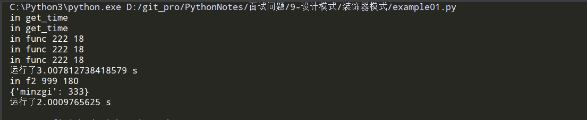
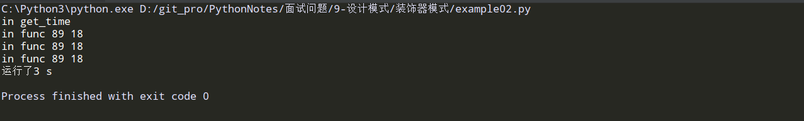
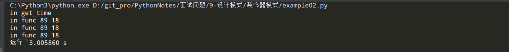
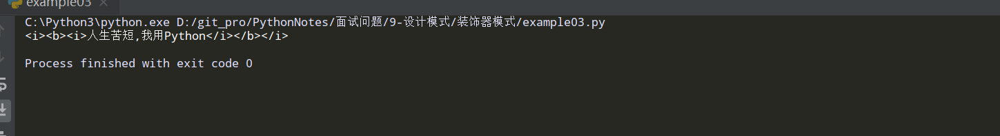
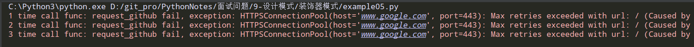

## 装饰器模式

### 开闭原则:

1、对已经实现的代码是关闭的,不允许修改。

2、对功能扩展是开放的，允许的。

### 装饰器函数：

```python
# -*- coding: utf-8 -*-
import time


def get_time(func):  # 这里只能接收一个参数,即使写成了*args **kwargs的形式
    """对函数运行时间进行统计"""
    print('in get_time')

    def inner(*args, **kwargs):  # 传参数,打包  内部函数可以接收任意参数
        t1 = time.time()
        # 解包参数  如果函数有返回值,暂时先保存,执行结束再返回
        # 这里的* 和** 是解包的作用,将刚刚打包的参数进行解包
        res = func(*args, **kwargs)  # res 暂时先保存执行结果
        t2 = time.time()
        print('运行了%s s' % (t2 - t1))
        # 如果 这里是 func(*args, **kwargs) 那么就会把func又执行了一遍,多余.
        return res  # 返回执行结果

    return inner


@get_time  # 只要这样写,就把 装饰器执行了  func1 = get_time(func1)
def func1(num, age=18):
    for i in range(3):
        time.sleep(1)
        print('in func', num, age)


@get_time  # 灵魂代码, 一旦装饰就执行
def func2(num, height=180, **kwargs):
    time.sleep(2)
    print('in f2', num, height)
    print(kwargs)
    return 250


func1(222)
func2(999, minzgi=333)

```

执行结果:



```
装饰器带参数  @装饰器(参数)
类装饰器
多个装饰器 装饰器

函数:函数代码空间的引用,可以传递,可以接收其他的引用

面向切面编程:AOP
意义:业务实现和其他细节隔开,扩展的就是细节.切面就是业务实现
其他细节就是新的功能
```


### 装饰器工厂函数:

```python
# -*- coding: utf-8 -*-
"""
需求:flag 参数传入0 希望时间用整数显示,参数传入非0, 用浮点数显示
"""
import time


def get_run_time(flag):
    """装饰器工厂函数"""

    def get_time(func):
        """装饰器函数:对函数运行时间进行统计"""
        print('in get_time')

        def inner(*args, **kwargs):
            t1 = time.time()
            res = func(*args, **kwargs)
            t2 = time.time()
            if flag == 0:
                print('运行了%d s' % (t2 - t1))
            else:
                print('运行了%f s' % (t2 - t1))
            return res

        return inner

    return get_time


# 装饰器工厂函数的作用:
# 1.>接收装饰器函数所需要但是又不能直接接受的参数---->接收参数
# 2.>生产装饰器对象---->产生装饰器函数

# 关联: 装饰器工厂内部是装饰器函数
# 真正执行过程:
# 1.> get_time = get_run_time(参数)
# 2.> @get_time 对func1函数进行装饰  func1 = get_time(func1)
@get_run_time(10)  # 这句话的返回值是get_time这个函数名
def func1(num, age=18):
    for i in range(3):
        time.sleep(1)
        print('in func', num, age)


# @get_run_time(1) 注意:这个要分开看    f1 = get_run_time(1) 这是一个整体,函数调用,然后返回一个值
# @f1 这才是真正的装饰器函数开始了

func1(89)

```

flag=0 执行结果:



flag=1 执行结果:



```
问题:
1.>装饰器工厂函数是装饰器函数吗?
不是,工厂内部定义了装饰器函数,并且return装饰器函数的引用
2.>装饰器工厂函数和装饰器的关系?
工厂函数的返回值是装饰器函数的引用(就是对象的地址,不是对象本身).它的作用就是创建一个装饰器函数的对象<或者叫地址引用更合适>
```


### 多个装饰器装饰一个函数:

```python
# -*- coding: utf-8 -*-
"""
<i> 斜体
<b> 加粗,黑体

多个装饰器:同时扩展多个功能
"""


def makeBold(func):
    """加粗"""

    def inner(*args, **kwargs):
        return '<b>' + func() + '</b>'

    return inner


def makeItalic(func):
    """倾斜"""

    def inner(*args, **kwargs):
        return '<i>' + func() + '</i>'

    return inner


@makeItalic
@makeBold
@makeItalic
def f1():
    return '人生苦短,我用Python'


print(f1())
# 执行结果: <i><b><i>人生苦短,我用Python</i></b></i>

# 执行顺序,先倾斜,后加粗, 类似于穿衣服,内衣先,外套后

# 灵魂代码理解:  f1 = makeItalic(f1)

# 1.>f11 = makeItalic(f1) f11是  makeItalic 里面的inner ;
# 2.>f111 = makeBold(f11) f111是makeBold 里面的inner

# 一步理解:  f1 = makeBold(makeItalic(f1))    ------> 简单理解就是多层装饰了
# 类似于寄快递,自己包一层之后快递小哥也会帮你再 包一层.

# 执行顺序一定是先去执行最内层的.<最内层的装饰器先完成装饰>
# 但是: 是最外层的最先开始装饰,它需要内层的装饰完成才能去装饰.

```

执行结果:




### 类装饰器:

```python
# -*- coding: utf-8 -*-
import time


class MyClass:
    def __init__(self, func):
        """需要接收一个被装饰的函数引用  相当于装饰器函数中外层函数的作用,接收 函数名 参数"""
        self._func = func

    def __call__(self, *args, **kwargs):
        """可以让一个对象变成可调用的对象 就是可以 以 对象() 这样的形式执行  相当于装饰器函数中内层函数,调用函数"""
        # 类装饰器可以实现的功能,没有装饰器函数的强大
        print('call方法被调用了')
        res = self._func(*args, **kwargs)  # self._func() 这样也可以
        return res


# 如果@后面的名字不是函数名,而是类名,称为类装饰器
# func1 = MyClass(func1)  创建一个实例对象<这个对象可以接受一个参数>
@MyClass
def func2(age):
    time.sleep(2)
    print('in f2:', age)


# 判断一个对象是否可调用,如果:一个对象(),那么对象是可调用的
# 常见的可调用对象:类 函数 匿名函数 方法  实现了__call__()的对象 记住:普通的对象不可以
# 普通的实例对象不是可调用的
print(callable(func2))  # 写了__call__()方法就是可调用的
print(callable(MyClass))
func2(56)
# callable 可被调用

"""
问题:
1.>func1 = MyClass(func1)  里面 的 func1 是啥?  是一个类创建的实例对象  
2.>可调用对象的特点:
如何判断可调用 callable()/对象.()  
3.>实现了__call__方法的实例对象是 

"""

```

执行结果:


### 经典应用: 请求重试

```python
# -*- coding: utf-8 -*-
import time
import six
from oslo_log import log
import requests

LOG = log.getLogger(__name__)


def retry(retry_times=3, interval=5, ignore=False):
    def _wrapper(func):
        @six.wraps(func)
        def __wrapper(*args, **kwargs):
            # 初始化一个实例对象
            Retry_obj = Retry(func, retry_times, interval, ignore)
            # 实例对象(): 调用实例,就是 执行 __call__() 方法
            return Retry_obj(*args, **kwargs)

        return __wrapper

    return _wrapper


class Retry(object):
    """任务重试器"""

    def __init__(self, func, retry_times=3, interval=5, ignore=False):
        self.func = func
        # retry_times等于-1表示重试无限次
        self.retry_times = retry_times
        self.attempt_times = 0
        self.interval = interval
        # 超出重试次数仍然失败后，是否忽略异常
        self.ignore = ignore

    def __call__(self, *args, **kwargs):
        while True:
            try:
                result = self.func(*args, **kwargs)
            except Exception as ex:
                # 计数器:统计重试的次数
                self.attempt_times += 1
                LOG.error(f'{self.attempt_times} time call func: {self.func.__name__} fail, exception: {ex}')
                # 能执行到这里,就已经说明重试过程已经完成
                if self.retry_times != -1 and self.attempt_times >= self.retry_times:
                    # 忽略异常情况下直接break,退出循环
                    if self.ignore:
                        break
                    # raise: 写了就把当前捕获的异常直接抛出,同时阻塞了程序继续运行
                    raise
                else:
                    time.sleep(self.interval)
            else:
                return result


@retry(retry_times=3, interval=2, ignore=True)
def request_github(url):
    """请求github"""
    with requests.Session() as session:
        ret = session.get(url)
        print(ret)


if __name__ == '__main__':
    github_url = "https://www.google.com/"
    request_github(github_url)

```

执行结果:



### 三、装饰器模式的优点和应用场景

优点：
1、装饰器模式是继承方式的一个替代方案，可以轻量级的扩展被装饰对象的功能；
2、Python的装饰器模式是实现AOP的一种方式，便于相同操作位于不同调用位置的统一管理。
应用场景：
1、需要扩展、增强或者减弱一个类的功能，如本例。

### 四、装饰器模式的缺点

1、多层装饰器的调试和维护有比较大的困难。